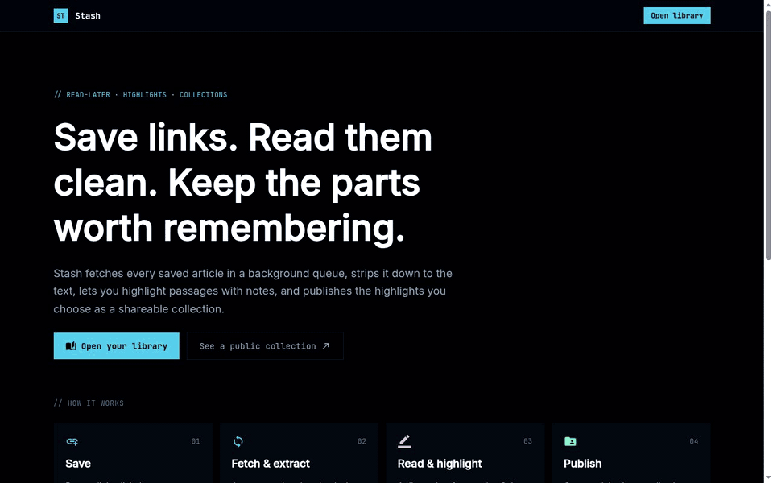

# Stash

Read-later + knowledge base app built with the TALL stack and Filament: save a link, a queue worker fetches and cleans the article, read it and highlight passages with notes, then publish chosen highlights as a public collection.

**Live demo: [stash.ionize13.com](https://stash.ionize13.com)** ("Try the demo" opens a private 24-hour sandbox: save links, read and highlight) · [Example public collection](https://stash.ionize13.com/c/systems-reading-list)



## Stack

- Laravel 13, PHP 8.5 (Sail runtime; CI runs PHP 8.4)
- Filament 5 admin panel at `/admin` (Livewire + Alpine + Tailwind)
- PostgreSQL 18 and Redis (queue, cache, session)
- Spatie Permission (roles `admin`, `demo`) and Activity Log
- Sanctum API tokens
- Pest tests against the Postgres `testing` database; Pint for lint

## Prerequisites

Docker and [Bun](https://bun.sh). No PHP, Composer or Node is needed on the host.

## Setup

```bash
cp .env.example .env
# first install only: get vendor/ without host PHP
docker run --rm -v "$PWD":/opt -w /opt laravelsail/php84-composer:latest \
  composer install --ignore-platform-reqs
./vendor/bin/sail up -d
./vendor/bin/sail artisan key:generate
./vendor/bin/sail artisan migrate:fresh --seed
bun install --frozen-lockfile && bun run build
```

The app is served at <http://localhost:8080> (`APP_PORT`; rootless Docker cannot bind port 80).
`APP_USER=root` and `SUPERVISOR_PHP_USER=root` in `.env` are for rootless Docker, where container root is your host user. On rootful Docker, remove both and set `WWWUSER`/`WWWGROUP` to your UID/GID.

## Seeded accounts (development only)

| Role  | Email               | Password (default) |
|-------|---------------------|--------------------|
| admin | admin@example.test  | `password` (`SEED_ADMIN_PASSWORD`) |
| demo  | demo@example.test   | `password` (`SEED_DEMO_PASSWORD`)  |

`demo` is read-only, enforced by policies. The seeder refuses to run in production.

## Commands

```bash
./vendor/bin/sail pest                 # tests
./vendor/bin/sail pint --test          # lint (drop --test to fix)
```

## API

`GET /api/user` requires `Authorization: Bearer <personal access token>`.

## Deploying

Production runs on a k3s cluster on Hetzner behind a Cloudflare Tunnel. CI builds the image (`ghcr.io/iodize13/stash`) after the tests pass; web, queue worker and scheduler run from it, with Postgres on CloudNativePG. See [docs/deploy.md](docs/deploy.md) for the image, the Kubernetes resources, the first deploy and releasing a new version.
